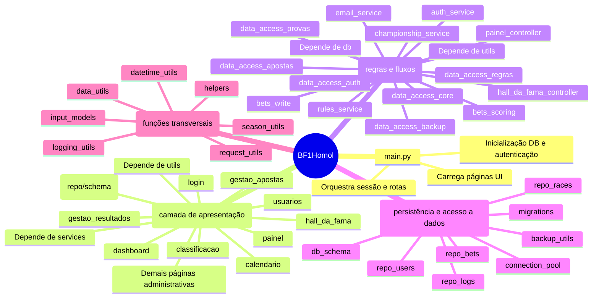
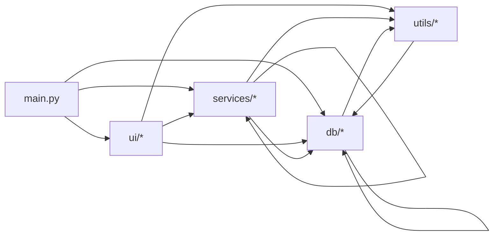

# Mapa Mental de Módulos - BF1Homol

Este documento apresenta uma visão técnica das relações entre os módulos da aplicação.

## Mapa Mental

## Relações Entre Camadas

## Dependências Internas Mais Relevantes

- main.py: depende de quase todas as páginas em ui e usa services.auth_service.
- ui.painel: integra db (repo/schema), services (apostas, scoring, auth, regras) e utils.
- ui.classificacao: usa services.bets_scoring e services.championship_service, além de repos db.
- services.bets_write: é um ponto de integração central entre db, regras, email e utilitários.
- services.auth_service: centraliza autenticação e consulta usuário via db.repo_users/db.db_schema.
- services.data_access_*: fachadas por dominio para reduzir acoplamento entre telas.

## Observações de Arquitetura

- A camada ui ainda acessa db diretamente em vários módulos, além de services.
- services concentra regras de negócio principais e orquestra gravações complexas.
- camada db foi consolidada em db_schema + repo_* (db_utils removido).
- utils contém funções transversais e utilitários de apresentação compartilhados.
