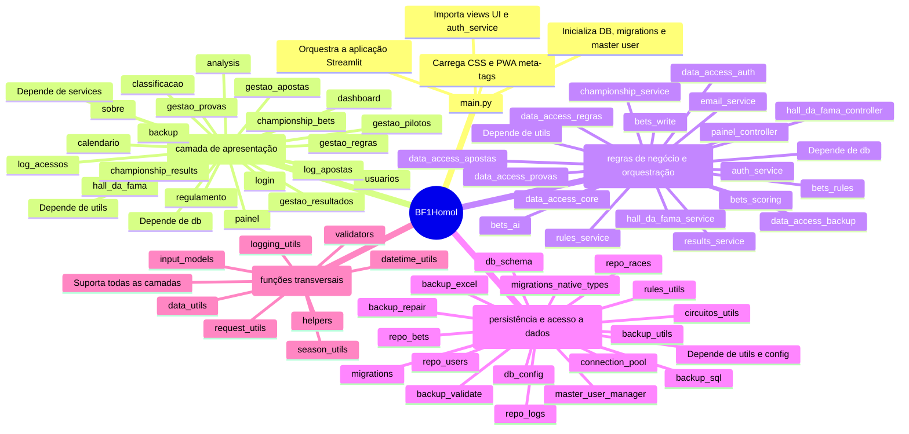
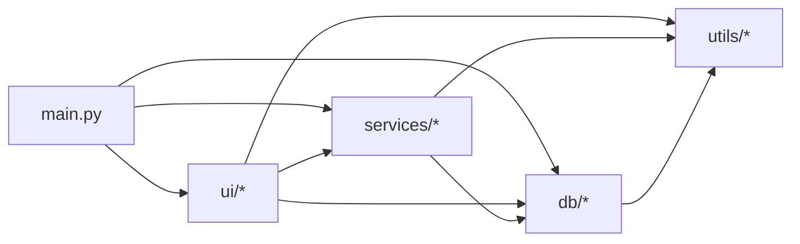

# Mapa Mental de Módulos - BF1Homol

Este documento apresenta uma visão técnica das relações entre os módulos da aplicação.

## Mapa Mental

## Relações Entre Camadas

## Dependências Internas Mais Relevantes

- `main.py`: coordena o carregamento das views, aplica tema e meta tags, inicializa banco e migrações e cria o master user.
- `ui/*`: representa as páginas da aplicação; cada módulo UI consome services para regras e db/repos para acesso a dados.
- `services.bets_write`: integra regras de negócio, persistência e notificações/suporte no fluxo de apostas.
- `services.auth_service`: guarda autenticação e sessão, trabalhando com `db.repo_users` e `db.db_schema`.
- `services.data_access_*`: atuam como camadas de acesso especializadas para domínios como apostas, provas, regras e backup.
- `services.hall_da_fama_service` / `services.hall_da_fama_controller`: gerenciam lógica de ranking e apresentação de histórico.

## Observações de Arquitetura

- A camada `ui` continua acessando `db` diretamente em vários pontos, além de depender de `services`.
- `services` centraliza regras e orquestra a escrita no banco, enquanto `data_access_*` cria fachadas para os repositórios.
- A camada `db` possui tanto schemas e repositórios quanto utilitários de backup e migrations.
- `utils` contém funções transversais e helpers compartilhados por todas as camadas.
- Existem também `assets/styles.css` e `static/*` para aparência e suporte a PWA/ícones, fora das camadas principais.
